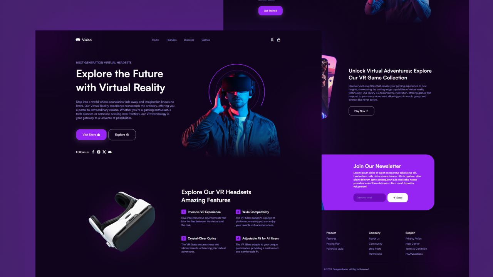

# Virtual Reality Experience Website

Welcome to the repository for our Next Generation Virtual Headsets website! This project is dedicated to creating an immersive online experience that showcases the future of virtual reality. The website aims to captivate visitors with a compelling hero section and provide a seamless and visually appealing journey through the possibilities of VR technology.



## Features

1. **Hero Section: Next Generation Virtual Headsets**
   - Engage users with a captivating introduction to the world of virtual reality.
   - Highlight the core message: "Explore the Future with Virtual Reality."
   - Convey the idea that our VR experience goes beyond ordinary boundaries, unlocking imagination without limits.

2. **Immersive Design**
   - Implement a visually stunning design that complements the futuristic theme of virtual reality.
   - Use modern HTML and CSS techniques to create a seamless and engaging user interface.
   - Ensure responsiveness for a flawless experience across various devices and screen sizes.

3. **Interactive Elements**
   - Incorporate interactive elements to enhance user engagement.
   - Include smooth transitions and animations that contribute to the overall immersive feel of the website.

4. **Content Sections**
   - Divide the content into sections that guide users through different aspects of the virtual reality experience.
   - Provide information for gaming enthusiasts, tech pioneers, and those seeking new frontiers.

5. **Gateway to Possibilities**
   - Emphasize the website as a gateway to a universe of possibilities.
   - Showcase the versatility of VR technology and its applications in various fields.

## How to Contribute

1. Fork the repository and clone it to your local machine.
2. Create a new branch for your contributions.
3. Implement new features, improve existing ones, or fix bugs.
4. Ensure your changes align with the project's style guide and coding standards.
5. Test your changes thoroughly on different devices and browsers.
6. Submit a pull request, providing a clear description of your changes.

## Getting Started

To run the project locally:

1. Clone the repository: 
```bash 
 git clone https://github.com/akhtarhssn/virtual-reality.git
```
5. Open the project in your favorite code editor.
6. Launch the `index.html` file in your browser to preview the website.

## Feedback and Issues

We welcome feedback, suggestions, and bug reports. Feel free to open an issue to share your thoughts or report any issues you encounter. Together, let's create an outstanding virtual reality experience for everyone!

Join us on this exciting journey into the future of Virtual Reality!

Happy coding! 🚀
